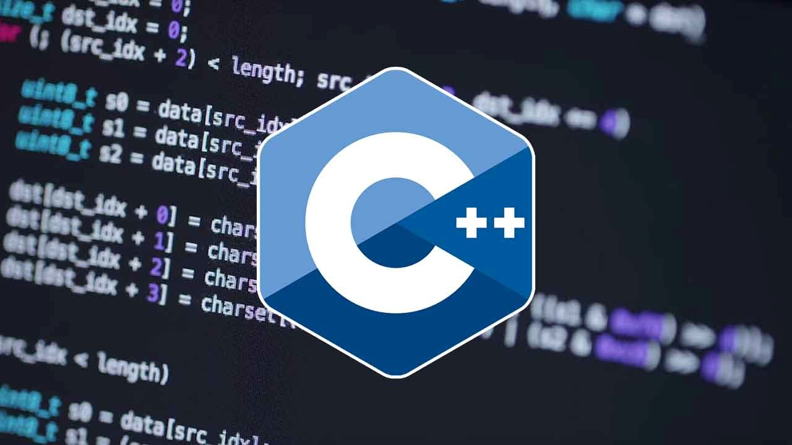
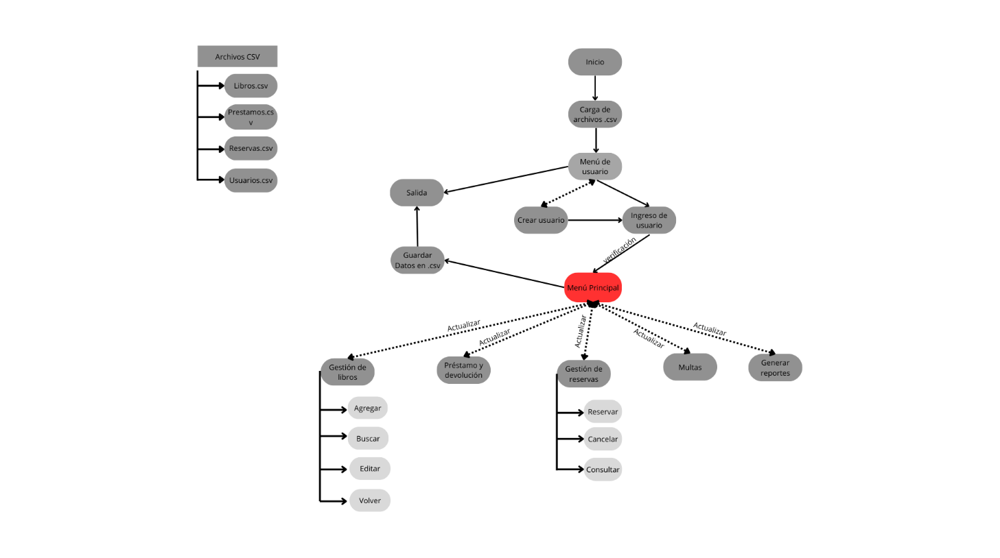

### Programación 1

## Simulador de Sistema de Gestión de Biblioteca

**Nombre**: Luciano Facundo Guardese  
**Fecha de entrega**: 06/03/25  

---

### 1. Resumen

Este proyecto implementa un sistema completo de gestión de biblioteca que permite administrar libros, usuarios, préstamos y reservas. El sistema está desarrollado con funciones básicas de C++ y utiliza archivos CSV para la persistencia de datos. Incluye funcionalidades como gestión de usuarios, control de préstamos, sistema de reservas, cálculo de multas y generación de reportes.

**Sus características principales son:**

- **Gestión de libros**: Permite registrar, actualizar y eliminar información de los libros disponibles, incluyendo título, autor, género y número de copias.  
- **Administración de usuarios**: Control de usuarios con diferentes roles (bibliotecarios y clientes), permitiendo el registro y seguimiento de los miembros de la biblioteca.  
- **Préstamos y devoluciones**: Registro de préstamos y devoluciones con control de fechas y notificaciones para evitar retrasos, además de incorporar la función de reserva.  
- **Búsqueda y categorización**: Sistema de búsqueda avanzada por título, autor o ISBN para facilitar la localización de libros.  
- **Generación de reportes**: Informes sobre libros disponibles, préstamos activos y usuarios con historial de uso, y total de multas de usuarios en conjunto.  

Este sistema está diseñado para bibliotecas de cualquier tamaño, optimizando la gestión y reduciendo el trabajo manual a través de una interfaz intuitiva y fácil de usar.

---

### 2. Introducción

La gestión eficiente de una biblioteca requiere un sistema que pueda manejar múltiples aspectos como el control de stock, préstamos, reservas y usuarios. Este proyecto aborda esta necesidad mediante una aplicación de consola que proporciona todas las funcionalidades necesarias básicas para la administración de una biblioteca moderna.

---

### 3. Diagrama de bloques

La función del programa en C++ se inicia con la carga de archivos `.csv` en los arreglos para la lectura y manipulación de datos, luego continúa con la verificación del usuario a ingresar, el cual se tendrá que validar mediante un *nombre de usuario* y *contraseña*. Si el usuario no se encuentra inscripto dentro de la base de datos del programa (`usuarios.csv`), este deberá crearse uno para poder ingresar al menú principal.

Una vez ingresado, se podrán utilizar diferentes opciones tales como:

- **Gestión de libros**: Donde se podrán buscar, agregar o editar los diversos libros que se encuentran en el archivo `Libros.csv`.  
- **Préstamos y devoluciones**: El usuario puede tomar prestado un libro, el cual se marcará la fecha de salida del mismo y contará con un tiempo determinado para su devolución. Una vez superado ese término, se le agregará una multa por devolución tardía.  
- **Gestión de reservas**: El usuario podrá reservar un libro ingresando el ISBN del mismo, y se generará un préstamo con fecha de devolución.  
- **Multas**: El usuario podrá visualizar si posee una multa pendiente y el recargo de la misma.  
- **Generar reportes**: El usuario podrá observar los libros más prestados y las multas totales de todos los usuarios.  
- **Salir**: Se podrá volver al menú de inicio y cerrar el programa.  

Ya completado el uso del programa, todos los datos escritos en los arreglos se guardarán en sus respectivos archivos CSV.

---

### 4. Desarrollo

El proyecto se desarrolló siguiendo un enfoque modular observando la funcionalidad simple de una biblioteca, dividiendo el sistema en componentes específicos:

- **Sistemas de archivos**:  
  - Utilización de archivos de tipo CSV como base de datos para el almacenamiento.  
  - Manipulación de dichos archivos utilizando la biblioteca `<fstream>`, la cual permite la lectura y escritura con las funciones `ifstream` (para lectura) y `ofstream` (para escritura).  

- **Gestión de usuarios**:  
  - Registro y autenticación a través de la interacción con el usuario; allí se utiliza el manejo de estructuras y arreglos para una mayor facilidad al manipular el código. La estructura ayuda a una mayor organización al ingreso de datos, mientras que el arreglo permite guardar dicha información en una variable.  
  - En el control de préstamos por usuario, se realiza un recorrido a través de los arreglos (mediante un método de búsqueda), lo que permite gestionar un nuevo préstamo o la devolución de un libro. Dicha devolución está ligada a una fecha determinada, y en caso de retraso, se aplicará una multa, la cual se verá reflejada en su usuario.  

- **Control de libros**:  
  - Para el manejo de inventario y búsqueda, se utiliza la lectura de archivos CSV para almacenar la información en arreglos. Una vez cargada, esta información puede ser manipulada. En la gestión del inventario, se emplean recorridos con `for` y comparaciones con `if`. Una vez encontrada la información buscada, se actualizan la cantidad y la disponibilidad del libro correspondiente.  
  - El estado de disponibilidad está definido como una variable booleana, la cual se verificará en función de la cantidad de libros, determinando así su estado actual.  

- **Sistema de Préstamos y Reservas**:  
  - Cuando un usuario desea pedir un libro prestado, ingresa su ISBN en el sistema. El sistema verifica si el libro está disponible en la biblioteca.  
    - Si el libro está disponible, se registra el préstamo en el sistema y se asigna una fecha de devolución de 14 días.  
    - Si el libro no está disponible, se informa al usuario y se le da la opción de reservarlo.  
    - Si el usuario acepta la reserva, este será ingresado en una lista de espera de la cual será notificado.  
  - Cada préstamo tiene una fecha de devolución establecida. Si el usuario no devuelve el libro a tiempo, se genera una multa basada en la cantidad de días de retraso.  
    - Ejemplo:  
      - El usuario debía devolver el libro el 10 de febrero, pero lo devuelve el 15 de febrero.  
      - El sistema calcula la multa en función de los 5 días de demora.  
  - Si un usuario quiere un libro que ya está prestado, puede reservarlo.  
    - El sistema guarda la reserva en una lista de espera, ordenando a los usuarios por fecha de solicitud.  
    - Cuando el libro es devuelto, el sistema:  
      - Revisa si hay una reserva activa.  
      - Si hay una reserva, asigna el libro al primer usuario en la lista de espera.  
      - Si no hay reservas, el libro queda disponible nuevamente para préstamo.  
  - El sistema muestra mensajes en pantalla para informar a los usuarios sobre su estado en el sistema:  
    - Cuando un usuario realiza una reserva, el sistema confirma la acción.  
    - Si hay una multa por retraso, el sistema notifica el monto a pagar.  
    - Cuando un libro reservado es devuelto, el sistema informa al usuario que lo tiene en espera.  

- **Cierre y Guardado de Datos**:  
  - Cada vez que el usuario finaliza una acción, el sistema guarda los datos actualizados en los archivos correspondientes.  
  - Esto garantiza que, al reiniciar el programa, se mantenga la información de préstamos, reservas y multas.

---

### 5. Teoría utilizada

- **Interacción con el usuario**:  
  El programa interactúa con el usuario mediante la consola, utilizando `cin` para leer datos y `cout` para mostrar información. En algunos casos se utilizó `cin.ignore()` para evitar problemas con el *buffer*.  

- **Estructuras de control**:  
  Se emplean estructuras de control para manejar la lógica del programa, lo que permite navegar entre las distintas opciones del sistema de manera estructurada, tales como el uso de `if`, `for`, `while` y `switch`.  

- **Paso de parámetros por referencia**:  
  Se utiliza el paso de parámetros por referencia, lo cual evita la duplicación innecesaria de información y retrasar el flujo.  

- **Funciones**:  
  La implementación de funciones permitió dividir el programa en bloques más pequeños y manejables. Cada función tiene una única responsabilidad, lo que facilita la organización y mantenimiento del código.  

- **Estructuras (`struct`)**:  
  Se utilizaron estructuras `struct` para agrupar datos relacionados en una sola entidad, facilitando su manipulación.  

- **Arreglos**:  
  Uso de arreglos para el almacenamiento de datos, en los cuales se tendrá un acceso más fácil tanto para leer como para editar variables.  

- **Manejo de archivos**:  
  Manejo de archivos para almacenamiento y lectura de información utilizando funciones de librería mencionadas con anterioridad, lo que permite la persistencia de datos.  

- **Librería `<ctime>`**:  
  Utilización de la librería `<ctime>` para el manejo de fechas.  

**Los códigos que considero más pertinentes son las funciones de carga y guardado de datos:**

- `void cargarDatos();`  
- `void guardarDatos();`  

Son quienes mantienen el flujo de información dentro del proyecto, ya que, sin ellos, al finalizar la ejecución del programa, toda la información ingresada sería perdida.

---

### 6. Conclusión

El desarrollo de este programa representó un gran reto, especialmente en la manipulación de archivos. Al inicio, la falta de experiencia en el manejo de archivos en C++ hizo que esta parte del código requiriera múltiples pruebas y ajustes para garantizar que la lectura y escritura de datos se realizara correctamente. A pesar de que finalmente se logró una implementación funcional, aún existen áreas de mejora en términos de eficiencia y control de errores.

Uno de los principales desafíos fue garantizar que los datos se procesaran correctamente desde los archivos CSV, asegurando que se respetara el formato y que no se perdiera información en la conversión de tipos. Además, se presentaron dificultades en la validación de los datos ingresados por el usuario y en la correcta actualización de los archivos después de cada operación. Muchas funciones necesitaron varios repasos y correcciones para optimizar su funcionamiento, pero aún se sienten incompletas, ya que sería necesario agregar controles de error más robustos para prevenir fallos o inconsistencias en los datos.

Un punto clave de mejora sería el uso más avanzado de vectores y estructuras de mapeo en lugar de los arreglos estáticos utilizados en la implementación actual. Esto permitiría manejar la información de los archivos CSV de una manera más eficiente, logrando un flujo más dinámico de datos y facilitando su manipulación en tiempo de ejecución. Con esta optimización, sería posible agregar o eliminar elementos con mayor facilidad, mejorar la velocidad de búsqueda de información y estructurar mejor el código, haciendo que su mantenimiento y ampliación fueran más sencillos.

En general, este proyecto ha sido una gran experiencia de aprendizaje, permitiendo comprender mejor no solo la programación estructurada en C++, sino también la importancia de una correcta gestión de datos y optimización de código. Aunque el sistema es funcional en su estado actual, existen múltiples oportunidades de mejora que podrían implementarse en futuras versiones para hacerlo más robusto, eficiente y fácil de mantener.